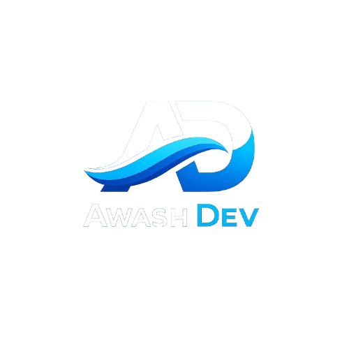

# Mohammed Hussen | Backend Architect & Systems Engineer



## 🚀 Engineering Performance, Architecting the Future

Digital pioneer from the **Afar Region, Ethiopia**, specializing in high-concurrency systems, distributed architectures, and invisible technology. I build robust foundations that handle millions of requests while maintaining human-centric empathy in every line of code.

---

### 🛠️ Technical Arsenal

- **Languages**: Go (Golang), Rust, Python, TypeScript
- **Frameworks**: Next.js, NestJS, FastAPI, Bun, Expo (Mobile)
- **Infrastructure**: PostgreSQL, Redis, Docker, Kubernetes, gRPC
- **Philosophy**: Performance as a service. User-centric distributed systems. Empathy in code.

---

### 🌐 Digital Footprint in Afar & Beyond

Proudly representing the **Afar region** in the global software landscape. I am dedicated to bringing world-class software engineering standards to local challenges and global markets.

- **Founder/Lead Engineer**: Focused on scalable software solutions.
- **Region Focus**: Afar, Ethiopia and International Remote.
- **Core Mission**: Solving real human challenges with bulletproof backend systems.

---

### 📦 Key Projects (Live from GitHub)

This portfolio dynamically pulls the latest shipments from my GitHub ecosystem. 

- **Systems Architecture**: Deep backend systems with extreme performance.
- **Mobile Ecosystems**: Modern, fluid mobile experiences using Expo.
- **API Design**: Secure, robust, and documented API standards.

---

### 🚀 Getting Started

To run this portfolio locally:

```bash
git clone https://github.com/awash-dev/modern-portfolios-.git
cd modern-portfolios-
npm install
npm run dev
```

---

### 📬 Connect with Me

- **Email**: hello@awashdev.com
- **GitHub**: [@awash-dev](https://github.com/awash-dev)
- **Location**: Ethiopia / Afar / Remote

---

*“Code isn’t just logic—it’s digital kindness.”*
